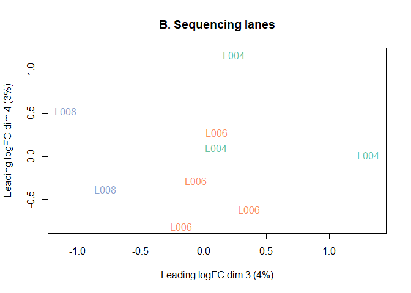
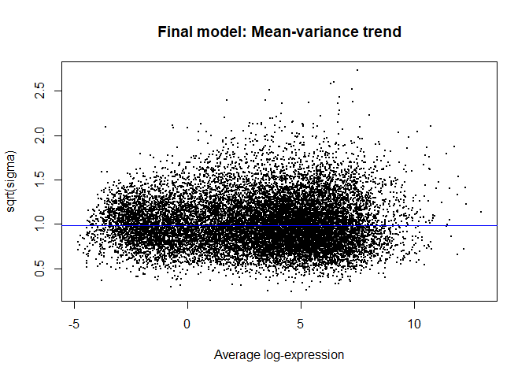
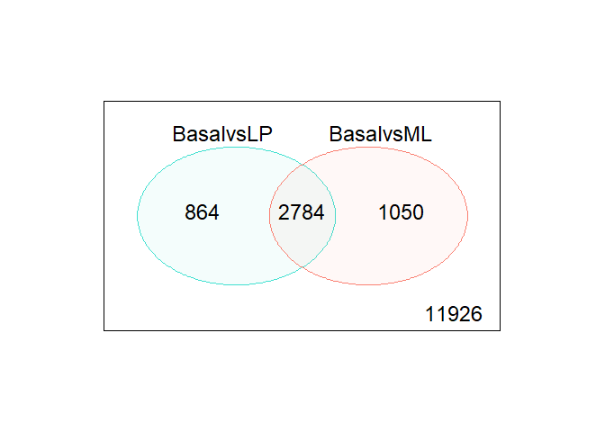
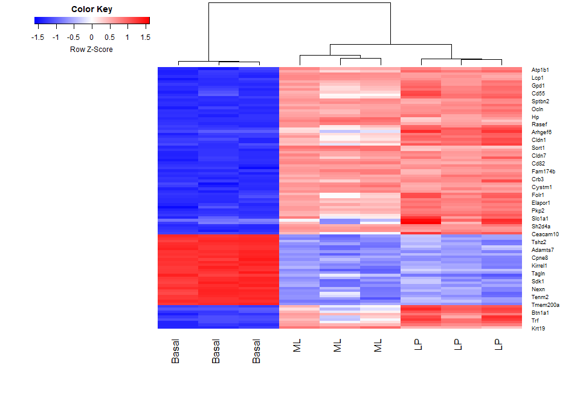
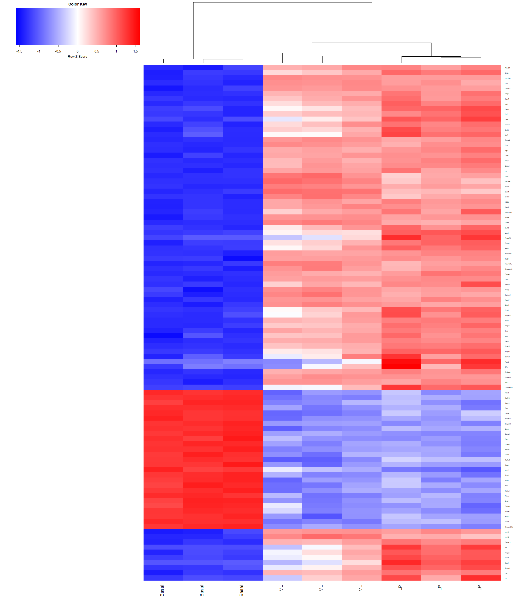

# RNA-Seq Analysis with RNAseq123 Workflow
Kate, Jessica, Kardam

## Introduction

Goal: Demonstrate the RNAseq123 Bioconductor workflow

Why this dataset?

- Public mouse mammary cell RNA-seq counts from GSE63310
- Includes biologically distinct groups: Basal, LP, and ML
- Small, well-structured example for showing an end-to-end workflow

What the workflow covers:

- data packaging
- filtering and normalization
- quality assessment
- differential expression analysis
- visualization and interpretation

This presentation is a worked example of how raw count data move through
a standard Bioconductor RNA-seq workflow

## Experimental Data

- “A pooled shRNA screen for regulators of primary mammary stem and
  progenitor cells identifies roles for Asap1 and Prox1”

- This experiment used RNA-seq-based expression profiling in mouse
  mammary stem cell (MaSC)-enriched basal cells to look for candidate
  regulatory genes

- Mammary stem cells are often used in RNA-seq analyses as they are
  highly proliferative and have a high capacity for differentiation

<!-- -->

- Regulatory genes produce proteins that turn expression on or off and
  are therefore important target genes for studying cancer as well as
  other developmental processes

- Using retroviral aided knockdown experiments and RNA-seq, the
  researchers were able to propose that the Asap1 gene is a negative
  regulator

- The gene count file used in this analysis was created by aligning
  reads with the mouse reference genome using the align function
  (Rsubread) followed by gene-level summarization using featureCounts

## Data Packaging

- We started with raw RNA-seq count files from GEO accession GSE63310
  and selected 9 samples representing Basal, LP, and ML mammary cell
  populations

- Using **edgeR**, we combined the individual count files into a single
  DGEList object, then added sample metadata such as biological group
  and sequencing lane. We also used **Mus.musculus** to attach gene
  annotations, including gene symbols and chromosome information

<!-- -->

- Data packaging converts separate raw files into one structured,
  analysis-ready dataset
- **edgeR**: combines the raw count files into a DGEList
- **Mus.musculus**: adds mouse gene annotations like symbols and
  chromosome info
- **R.utils**: unzips the downloaded .gz count files

## Data Pre-Processing

- Why data pre-processing?
- Goal is to compare gene expression across groups
- The following steps can be performed to pre-process the data with this
  workflow:

1.  Transform raw counts to CPM and log-CPM
2.  Filter out genes with very low expression
3.  Normalize libraries using TMM normalization using **edgeR**

- Once raw counts were transformed to CPM and log-CPM, lowly expressed
  genes can be filtered out

- Normalization of the libraries using TMM normalization with **edgeR**

- MDS plots are used to check whether samples clustered by biology
  rather than technical artifacts
- `plotMDS()` from **limma** is used as an unsupervised quality control
  step
- This preprocessing step reduces noise, improves comparability across
  samples, and helps confirm that the data are ready for differential
  expression testing

<!-- -->

- MDS plots show samples cluster by biological group (Basal, LP, ML) and
  not by sequencing lane
- This suggests the main signal is biological and technical effects are
  limited

- Preprocessing removes uninformative genes, corrects library-size
  effects, and checks overall sample quality before modeling
- Primarily performed with **edgeR**, and **limma** is used for QC

## Differential Gene Analysis

- To determine which genes are expressed at different levels between
  three cell population profiled
- linear model fitting (assuming normally distributed data)
- Intercept act as anchor point for comparision against baseline
- Without intercept, absolute expression levels can be determined

<!-- -->

      Basal LP ML laneL006 laneL008
    1     0  1  0        0        0
    2     0  0  1        0        0
    3     1  0  0        0        0
    4     1  0  0        1        0
    5     0  0  1        1        0
    6     0  1  0        1        0
    7     1  0  0        1        0
    8     0  0  1        0        1
    9     0  1  0        0        1
    attr(,"assign")
    [1] 1 1 1 2 2
    attr(,"contrasts")
    attr(,"contrasts")$group
    [1] "contr.treatment"

    attr(,"contrasts")$lane
    [1] "contr.treatment"

- ‘makecontrast()’ function from **limma** package allows user to draw
  contrax matrix for pairwise comparisions

- Provides duplicate correlation to deal with technical replicates

- Also provides flexibility to perform interactive studies for ex.
  testing drug reaction in Lane 6 and Lane 8

<!-- -->

              Contrasts
    Levels     BasalvsLP BasalvsML LPvsML
      Basal            1         1      0
      LP              -1         0      1
      ML               0        -1     -1
      laneL006         0         0      0
      laneL008         0         0      0

## Heteroscedascity and Voom weights

- Homoscedascity: In linear models, mean-variance relationship is
  assumed to be linear. Mean and variance changes equally. Exactly
  opposite is ‘Heteroscedascity’

- In RNA-Seq count data, the Negative Binomial distribution assumes
  quadratic mean-variation relationship

- Overdispersion observed due to large difference between house-keeping
  genes and highly expressed genes

- In **limma**, linear modelling is carried out on log-CPM values

<!-- -->

- “voom” function act as link to bridge limma(built for microarrays) to
  expression data. It addresses scale problem (calculates into CPM) and
  “normalize.method” argument to normalize library size and estimates
  mean-variance relationship (non-linear - overdispersion)

- “Voom weights” fixes the noise related to genes whereas
  Voomqualityweight addresses the noise generated from inter-sample
  variation

<!-- -->

    An object of class "EList"
    $genes
      ENTREZID SYMBOL TXCHROM
    1   497097   Xkr4    chr1
    5    20671  Sox17    chr1
    6    27395 Mrpl15    chr1
    7    18777 Lypla1    chr1
    9    21399  Tcea1    chr1
    16619 more rows ...

    $targets
                                 files group lib.size norm.factors lane
    10_6_5_11 GSM1545535_10_6_5_11.txt    LP 29387429    0.8943956 L004
    9_6_5_11   GSM1545536_9_6_5_11.txt    ML 36212498    1.0250186 L004
    purep53     GSM1545538_purep53.txt Basal 59771061    1.0459005 L004
    JMS8-2       GSM1545539_JMS8-2.txt Basal 53711278    1.0458455 L006
    JMS8-3       GSM1545540_JMS8-3.txt    ML 77015912    1.0162707 L006
    JMS8-4       GSM1545541_JMS8-4.txt    LP 55769890    0.9217132 L006
    JMS8-5       GSM1545542_JMS8-5.txt Basal 54863512    0.9961959 L006
    JMS9-P7c   GSM1545544_JMS9-P7c.txt    ML 23139691    1.0861026 L008
    JMS9-P8c   GSM1545545_JMS9-P8c.txt    LP 19634459    0.9839203 L008

    $E
            Samples
    Tags     10_6_5_11  9_6_5_11   purep53     JMS8-2    JMS8-3    JMS8-4    JMS8-5
      497097 -4.292165 -3.856488 2.5185849  3.2931366 -4.459730 -3.994060 3.2869677
      20671  -4.292165 -4.593453 0.3560126 -0.4073032 -1.200995 -1.943434 0.8442767
      27395   3.876089  4.413107 4.5170045  4.5617546  4.344401  3.786363 3.8990635
      18777   4.708774  5.571872 5.3964008  5.1623650  5.649355  5.081611 5.0602470
      21399   4.785541  4.754537 5.3703795  5.1220551  4.869586  4.943840 5.1384776
            Samples
    Tags       JMS9-P7c  JMS9-P8c
      497097 -3.2103696 -5.295316
      20671  -0.3228444 -1.207853
      27395   4.3396075  4.124644
      18777   5.7513694  5.142436
      21399   5.0308985  4.979644
    16619 more rows ...

    $weights
              [,1]      [,2]      [,3]      [,4]      [,5]      [,6]      [,7]
    [1,]  1.079413  1.332986 19.826915 20.273253  1.993686  1.395853 20.494977
    [2,]  1.170357  1.456380  4.804866  8.660025  3.612508  2.626870  8.760149
    [3,] 20.219073 25.573792 30.434759 28.528310 31.352260 25.743247 28.722497
    [4,] 26.947557 32.505933 33.583128 33.232125 34.231754 32.354158 33.334340
    [5,] 26.610864 28.501638 33.645479 33.206374 33.573492 31.996623 33.308490
              [,8]      [,9]
    [1,]  1.107780  1.079413
    [2,]  3.211473  2.541942
    [3,] 21.200072 16.657930
    [4,] 30.348630 24.259801
    [5,] 25.171513 23.573305
    16619 more rows ...

    $design
      Basal LP ML laneL006 laneL008
    1     0  1  0        0        0
    2     0  0  1        0        0
    3     1  0  0        0        0
    4     1  0  0        1        0
    5     0  0  1        1        0
    6     0  1  0        1        0
    7     1  0  0        1        0
    8     0  0  1        0        1
    9     0  1  0        0        1
    attr(,"assign")
    [1] 1 1 1 2 2
    attr(,"contrasts")
    attr(,"contrasts")$group
    [1] "contr.treatment"

    attr(,"contrasts")$lane
    [1] "contr.treatment"

Means (x-axis) and variances (y-axis) of each gene are plotted to show
the dependence between the two before voom is applied to the data (left
panel) and how the trend is removed after voom precision weights are
applied to the data (right panel)

## Examining Differentially Expressed Genes:

Summary of Differentially expressed gene:

           BasalvsLP BasalvsML LPvsML
    Down        4648      4927   3135
    NotSig      7113      7026  10972
    Up          4863      4671   2517

Treat method - Method can be applied for stricter definition on
significance based on t-statistics. This allows user to define a log-FC
threshold

           BasalvsLP BasalvsML LPvsML
    Down        1632      1777    224
    NotSig     12976     12790  16210
    Up          2016      2057    190

    [1] 2784

     [1] "Xkr4"          "Rgs20"         "Cpa6"          "A830018L16Rik"
     [5] "Sulf1"         "Eya1"          "Msc"           "Sbspon"       
     [9] "Pi15"          "Crispld1"      "Kcnq5"         "Rims1"        
    [13] "Khdrbs2"       "Ptpn18"        "Prss39"        "Arhgef4"      
    [17] "Cnga3"         "Cracdl"        "Aff3"          "Npas2"        

- O - represents genes with levels unchanged
- 1 - Up regulated genes
- 1 - Down regulated genes

## Extracting DE genes:

Venn diagram showing the number of genes DE in the comparison between
basal versus LP only (left), basal versus ML only (right), and the
number of genes that are DE in both comparisons (center)

The number of genes that are not DE in either comparison are marked in
the bottom-right

## Examining Individual DE Genes from Top to Bottom:

- “topTreat”/ “topTable” - from toptreat or eBayes to list top DE genes

- toptreat arranges DE genes chronologically in increasing order using
  log-FC, average log-CPM, moderated t-statistics, raw and adjusted
  p-value for each gene

- n=Inf -\> all genes

<!-- -->

           ENTREZID SYMBOL TXCHROM     logFC  AveExpr         t      P.Value
    12759     12759    Clu   chr14 -5.455444 8.856581 -33.55508 1.723731e-10
    53624     53624  Cldn7   chr11 -5.527356 6.295437 -31.97515 2.576972e-10
    242505   242505  Rasef    chr4 -5.935249 5.118259 -31.33407 3.081544e-10
    67451     67451   Pkp2   chr16 -5.738665 4.419170 -29.85616 4.575686e-10
    228543   228543   Rhov    chr2 -6.264208 5.485314 -29.07484 5.782844e-10
    70350     70350  Basp1   chr15 -6.084738 5.247023 -28.26649 7.267694e-10
              adj.P.Val
    12759  1.707586e-06
    53624  1.707586e-06
    242505 1.707586e-06
    67451  1.739242e-06
    228543 1.739242e-06
    70350  1.739242e-06

## Useful Graphical Representations of Differential Expression Results

- `plotMD()` from **limma** summarizes all genes by plotting log-fold
  change against average log-CPM, with DE genes highlighted

- `glMDPlot()` from **Glimma** adds an interactive MD plot so individual
  genes can be searched and inspected sample-by-sample

- A heatmap of the top 100 DE genes shows whether samples cluster by
  biology and whether related groups share expression patterns
- Focuses on the strongest DE genes and highlights sample clustering by
  cell type

## Camera: Correlation Adjusted MEan RAnk gene set test

- The camera (Correlation Adjusted MEan Rank) method compares the DE
  values of our gene set to the same values of all other gene sets to
  determine their relative “rank” of importance.

- The aggregated gene set data is the c2 gene signatures collection from
  the Broad Institute’s Molecular Signatures Database (MSigDB).

- This method is more of a meta-analysis, not ideal for focused
  within-experiment testing, but great for exploratory analysis to find
  candidate genes for further study.

<!-- -->

                                                NGenes Direction       PValue
    LIM_MAMMARY_STEM_CELL_UP                       791        Up 1.768426e-18
    LIM_MAMMARY_STEM_CELL_DN                       683      Down 4.027711e-14
    ROSTY_CERVICAL_CANCER_PROLIFERATION_CLUSTER    170        Up 5.518131e-14
    LIM_MAMMARY_LUMINAL_PROGENITOR_UP               94      Down 2.737492e-13
    SOTIRIOU_BREAST_CANCER_GRADE_1_VS_3_UP         190        Up 5.155264e-13
                                                         FDR
    LIM_MAMMARY_STEM_CELL_UP                    8.355813e-15
    LIM_MAMMARY_STEM_CELL_DN                    8.691057e-11
    ROSTY_CERVICAL_CANCER_PROLIFERATION_CLUSTER 8.691057e-11
    LIM_MAMMARY_LUMINAL_PROGENITOR_UP           3.233663e-10
    SOTIRIOU_BREAST_CANCER_GRADE_1_VS_3_UP      4.871724e-10

## Results

- The genes *Rasef* and *Cldn7* were both top DE genes for both the
  BasalvsLP and BasalvsML comparisons. *Rasef* has been shown to act as
  a tumor supressor, while the dysregulation of *Cldn7* in either
  direction is associated with cancer risk and/or progression.

## Conclusion:

**What interesting things / skills did you learn?**

    Skills learned:

- To setup data from web to R/positron.
- To organize multiple files into single matrix using only one function
  from edgeR package.
- Organizing gene info and annotations.
- Filtering genes that holds biological importance.
- Unsupervised clustering of samples.
- Desgining model and contrast matrices.

**Interesting points learned:**

- filtering data improves the scopes of visualization.

- filterByexp function that removes the genes with low expression
  values. However, it does not filter the control whose expression value
  could be near 0 or 0.

- calcNormfactor using TMM function works on logic where over & under
  expressed genes are ignored initially to plot a baseline. Once the
  baseline is plotted, the genes are cross-references for accurate
  comparison to avoid the compositional bias.

- Heteroscedascity must be addressed to get results at actuals.

- Stricter log-CPM values can be applied for sophisticated studies.

## Conclusion:

\*\* What challenges did you come across?\*\*

- Several plots had to be resized to render properly

3.  Main result
4.  Limitation
5.  Next steps
