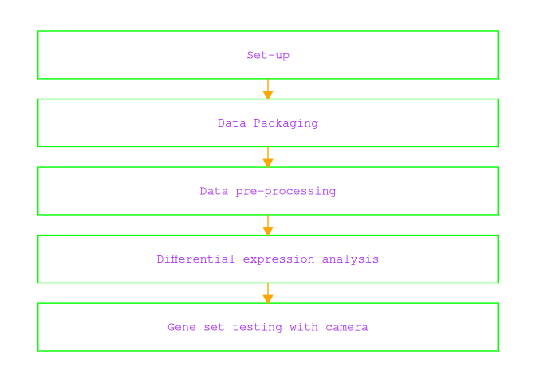
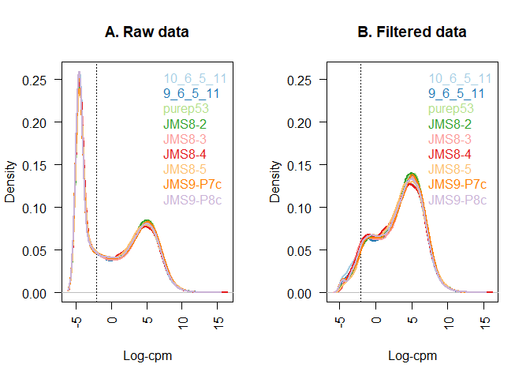
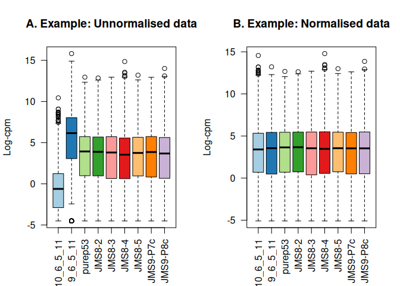
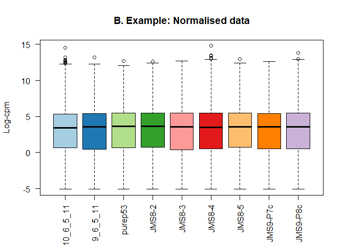
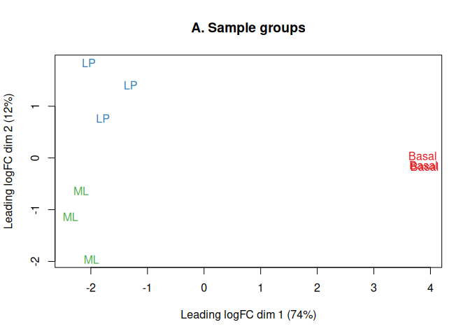
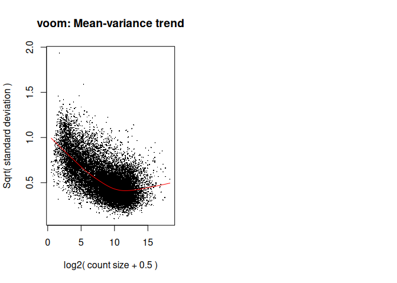
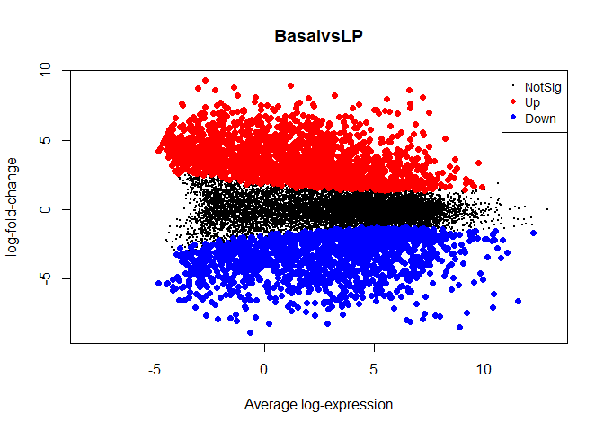

# RNA-seq analysis with RNASeq123 workflow
Kate, Jessica, Kardam

Load needed packages:

Load Dependencies for flowchart

## Introduction

RNAseq123 Workflow:

## Experimental Data

“A pooled shRNA screen for regulators of primary mammary stem and
progenitor cells identifies roles for Asap1 and Prox1”

This experiment used RNA-seq-based expression profiling in mouse mammary
stem cell (MaSC)-enriched basal cells to look for candidate regulatory
genes.

Mammary stem cells are often used in RNA-seq analyses as they are highly
proliferative and have a high capacity for differentiation.

Regulatory genes produce proteins that turn expression on or off and are
therefore important target genes for studying cancer as well as other
developmental processes.

Using retroviral aided knockdown experiments and RNA-seq, the
researchers were able to propose that the Asap1 gene is a negative
regulator.

The gene count file used in this analysis was created by aligning reads
with the mouse reference genome using the align function (Rsubread)
followed by gene-level summarization using featureCounts.

## Data Packaging

- We started with raw RNA-seq count files from GEO accession GSE63310
  and selected 9 samples representing Basal, LP, and ML mammary cell
  populations.

- Using edgeR, we combined the individual count files into a single
  DGEList object, then added sample metadata such as biological group
  and sequencing lane. We also used Mus.musculus to attach gene
  annotations, including gene symbols and chromosome information.

Data packaging converts separate raw files into one structured,
analysis-ready dataset.

## Data pre-processing

- Before comparing gene expression across groups, we transformed raw
  counts to CPM and log-CPM, filtered out genes with very low
  expression, and normalized the libraries using TMM normalization with
  edgeR.

- We then used MDS plots to check whether samples clustered by biology
  rather than technical artifacts.

- This preprocessing step reduces noise, improves comparability across
  samples, and helps confirm that the data are ready for differential
  expression testing.

Preprocessing removes uninformative genes, corrects library-size
effects, and checks overall sample quality before modeling.

    [1] "DGEList"
    attr(,"package")
    [1] "edgeR"

    [1] 27179     9

    [1] "10_6_5_11" "9_6_5_11"  "purep53"   "JMS8-2"    "JMS8-3"    "JMS8-4"   
    [7] "JMS8-5"    "JMS9-P7c"  "JMS9-P8c" 

                                 files group lib.size norm.factors lane
    10_6_5_11 GSM1545535_10_6_5_11.txt    LP 32863052            1 L004
    9_6_5_11   GSM1545536_9_6_5_11.txt    ML 35335491            1 L004
    purep53     GSM1545538_purep53.txt Basal 57160817            1 L004
    JMS8-2       GSM1545539_JMS8-2.txt Basal 51368625            1 L006
    JMS8-3       GSM1545540_JMS8-3.txt    ML 75795034            1 L006
    JMS8-4       GSM1545541_JMS8-4.txt    LP 60517657            1 L006
    JMS8-5       GSM1545542_JMS8-5.txt Basal 55086324            1 L006
    JMS9-P7c   GSM1545544_JMS9-P7c.txt    ML 21311068            1 L008
    JMS9-P8c   GSM1545545_JMS9-P8c.txt    LP 19958838            1 L008

       ENTREZID  SYMBOL TXCHROM
    1    497097    Xkr4    chr1
    2 100503874 Gm19938    <NA>
    3 100038431 Gm10568    <NA>
    4     19888     Rp1    chr1
    5     20671   Sox17    chr1
    6     27395  Mrpl15    chr1

    An object of class "DGEList"
    $samples
                                 files group lib.size norm.factors lane
    10_6_5_11 GSM1545535_10_6_5_11.txt    LP 32863052            1 L004
    9_6_5_11   GSM1545536_9_6_5_11.txt    ML 35335491            1 L004
    purep53     GSM1545538_purep53.txt Basal 57160817            1 L004
    JMS8-2       GSM1545539_JMS8-2.txt Basal 51368625            1 L006
    JMS8-3       GSM1545540_JMS8-3.txt    ML 75795034            1 L006
    JMS8-4       GSM1545541_JMS8-4.txt    LP 60517657            1 L006
    JMS8-5       GSM1545542_JMS8-5.txt Basal 55086324            1 L006
    JMS9-P7c   GSM1545544_JMS9-P7c.txt    ML 21311068            1 L008
    JMS9-P8c   GSM1545545_JMS9-P8c.txt    LP 19958838            1 L008

    $counts
               Samples
    Tags        10_6_5_11 9_6_5_11 purep53 JMS8-2 JMS8-3 JMS8-4 JMS8-5 JMS9-P7c
      497097            1        2     342    526      3      3    535        2
      100503874         0        0       5      6      0      0      5        0
      100038431         0        0       0      0      0      0      1        0
      19888             0        1       0      0     17      2      0        1
      20671             1        1      76     40     33     14     98       18
               Samples
    Tags        JMS9-P8c
      497097           0
      100503874        0
      100038431        0
      19888            0
      20671            8
    27174 more rows ...

    $genes
       ENTREZID  SYMBOL TXCHROM
    1    497097    Xkr4    chr1
    2 100503874 Gm19938    <NA>
    3 100038431 Gm10568    <NA>
    4     19888     Rp1    chr1
    5     20671   Sox17    chr1
    27174 more rows ...

    [1] 45.48855 51.36862

       10_6_5_11          9_6_5_11          purep53             JMS8-2       
     Min.   :-4.5074   Min.   :-4.5074   Min.   :-4.50743   Min.   :-4.5074  
     1st Qu.:-4.5074   1st Qu.:-4.5074   1st Qu.:-4.50743   1st Qu.:-4.5074  
     Median :-0.6847   Median :-0.3589   Median :-0.09513   Median :-0.0901  
     Mean   : 0.1714   Mean   : 0.3312   Mean   : 0.43559   Mean   : 0.4089  
     3rd Qu.: 4.2913   3rd Qu.: 4.5601   3rd Qu.: 4.60081   3rd Qu.: 4.5475  
     Max.   :14.7632   Max.   :13.4952   Max.   :12.95700   Max.   :12.8513  
         JMS8-3            JMS8-4            JMS8-5            JMS9-P7c      
     Min.   :-4.5074   Min.   :-4.5074   Min.   :-4.50743   Min.   :-4.5074  
     1st Qu.:-4.5074   1st Qu.:-4.5074   1st Qu.:-4.50743   1st Qu.:-4.5074  
     Median :-0.4281   Median :-0.4064   Median :-0.07152   Median :-0.1704  
     Mean   : 0.3225   Mean   : 0.2529   Mean   : 0.40428   Mean   : 0.3708  
     3rd Qu.: 4.5772   3rd Qu.: 4.3199   3rd Qu.: 4.42513   3rd Qu.: 4.6031  
     Max.   :12.9578   Max.   :14.8520   Max.   :13.19491   Max.   :12.9413  
        JMS9-P8c      
     Min.   :-4.5074  
     1st Qu.:-4.5074  
     Median :-0.3300  
     Mean   : 0.2749  
     3rd Qu.: 4.4355  
     Max.   :14.0102  

    FALSE  TRUE 
    22026  5153 

    [1] 16624     9

    [1] 0.8943956 1.0250186 1.0459005 1.0458455 1.0162707 0.9217132 0.9961959
    [8] 1.0861026 0.9839203

    [1] 0.05770899 6.08287835 1.22023972 1.16478991 1.19661094 1.04659233 1.15048074
    [8] 1.25431164 1.10901983

## Differential Gene Analysis:

- To determine which genes are expressed at different levels between
  three cell population profiled.
- linear model fitting (assuming normally distributed data)
- Intercept act as anchor point for comparision against baseline.
- Without intercept, absolute expression levels can be determined.

<!-- -->

      Basal LP ML laneL006 laneL008
    1     0  1  0        0        0
    2     0  0  1        0        0
    3     1  0  0        0        0
    4     1  0  0        1        0
    5     0  0  1        1        0
    6     0  1  0        1        0
    7     1  0  0        1        0
    8     0  0  1        0        1
    9     0  1  0        0        1
    attr(,"assign")
    [1] 1 1 1 2 2
    attr(,"contrasts")
    attr(,"contrasts")$group
    [1] "contr.treatment"

    attr(,"contrasts")$lane
    [1] "contr.treatment"

## Heteroscedascity and Voom weights:

- Homoscedascity: In linear models, mean-variance relationship is
  assumed to be linear. Mean and variance changes equally. Exactly
  opposite is ‘Heteroscedascity’.

- In RNA-Seq count data, the Negative Binomial distribution assumes
  quadratic mean-variation relationship.

- Overdispersion observed due to large difference between house-keeping
  genes and highly expressed genes

- In limma, linear modelling is carried out on log-CPM values.

- “voom” function act as link to bridge limma(built for microarrays) to
  expression data. It addresses scale problem (calculates into CPM) and
  “normalize.method” argument to normalize library size and estimates
  mean-variance relationship (non-linear - overdispersion)

- “Voom weights” fixes the noise related to genes whereas
  Voomqualityweight addresses the noise generated from inter-sample
  variation.

<!-- -->

    An object of class "EList"
    $genes
      ENTREZID SYMBOL TXCHROM
    1   497097   Xkr4    chr1
    5    20671  Sox17    chr1
    6    27395 Mrpl15    chr1
    7    18777 Lypla1    chr1
    9    21399  Tcea1    chr1
    16619 more rows ...

    $targets
                                 files group lib.size norm.factors lane
    10_6_5_11 GSM1545535_10_6_5_11.txt    LP 29387429    0.8943956 L004
    9_6_5_11   GSM1545536_9_6_5_11.txt    ML 36212498    1.0250186 L004
    purep53     GSM1545538_purep53.txt Basal 59771061    1.0459005 L004
    JMS8-2       GSM1545539_JMS8-2.txt Basal 53711278    1.0458455 L006
    JMS8-3       GSM1545540_JMS8-3.txt    ML 77015912    1.0162707 L006
    JMS8-4       GSM1545541_JMS8-4.txt    LP 55769890    0.9217132 L006
    JMS8-5       GSM1545542_JMS8-5.txt Basal 54863512    0.9961959 L006
    JMS9-P7c   GSM1545544_JMS9-P7c.txt    ML 23139691    1.0861026 L008
    JMS9-P8c   GSM1545545_JMS9-P8c.txt    LP 19634459    0.9839203 L008

    $E
            Samples
    Tags     10_6_5_11  9_6_5_11   purep53     JMS8-2    JMS8-3    JMS8-4    JMS8-5
      497097 -4.292165 -3.856488 2.5185849  3.2931366 -4.459730 -3.994060 3.2869677
      20671  -4.292165 -4.593453 0.3560126 -0.4073032 -1.200995 -1.943434 0.8442767
      27395   3.876089  4.413107 4.5170045  4.5617546  4.344401  3.786363 3.8990635
      18777   4.708774  5.571872 5.3964008  5.1623650  5.649355  5.081611 5.0602470
      21399   4.785541  4.754537 5.3703795  5.1220551  4.869586  4.943840 5.1384776
            Samples
    Tags       JMS9-P7c  JMS9-P8c
      497097 -3.2103696 -5.295316
      20671  -0.3228444 -1.207853
      27395   4.3396075  4.124644
      18777   5.7513694  5.142436
      21399   5.0308985  4.979644
    16619 more rows ...

    $weights
              [,1]      [,2]      [,3]      [,4]      [,5]      [,6]      [,7]
    [1,]  1.031010  1.282577 20.143626 20.598915  1.950799  1.345475 20.825144
    [2,]  1.120826  1.406203  4.930805  8.761051  3.645647  2.601377  8.862788
    [3,] 20.543645 26.132254 31.033311 29.121837 31.978075 26.308447 29.316218
    [4,] 27.548060 33.178993 34.343505 33.948156 34.797458 33.021348 34.057882
    [5,] 27.203566 29.095135 34.416318 33.920517 34.332254 32.649789 34.030131
              [,8]      [,9]
    [1,]  1.058972  1.031010
    [2,]  3.214078  2.513545
    [3,] 21.548697 16.889080
    [4,] 30.944851 24.744809
    [5,] 25.707167 24.020893
    16619 more rows ...

    $design
      Basal LP ML laneL006 laneL008
    1     0  1  0        0        0
    2     0  0  1        0        0
    3     1  0  0        0        0
    4     1  0  0        1        0
    5     0  0  1        1        0
    6     0  1  0        1        0
    7     1  0  0        1        0
    8     0  0  1        0        1
    9     0  1  0        0        1
    attr(,"assign")
    [1] 1 1 1 2 2
    attr(,"contrasts")
    attr(,"contrasts")$group
    [1] "contr.treatment"

    attr(,"contrasts")$lane
    [1] "contr.treatment"

    $span
    [1] 0.4010438

Means (x-axis) and variances (y-axis) of each gene are plotted to show
the dependence between the two before voom is applied to the data (left
panel) and how the trend is removed after voom precision weights are
applied to the data (right panel)

## Examining Differentially Expressed Genes:

Summary of Differentially expressed gene:

           BasalvsLP BasalvsML LPvsML
    Down        4646      4936   3141
    NotSig      7118      7008  10953
    Up          4860      4680   2530

Treat method - Method can be applied for stricter definition on
significance based on t-statistics. This allows user to define a log-FC
threshold.

           BasalvsLP BasalvsML LPvsML
    Down        1633      1777    223
    NotSig     12977     12793  16211
    Up          2014      2054    190

## Examining individual DE genes from top to bottom:

- “topTreat”/ “topTable” - from toptreat or eBayes to list top DE genes.

- toptreat arranges DE genes chronologically in increasing order using
  log-FC, average log-CPM, moderated t-statistics, raw and adjusted
  p-value for each gene

- n=Inf -\> all genes

<!-- -->

           ENTREZID SYMBOL TXCHROM     logFC  AveExpr         t      P.Value
    12759     12759    Clu   chr14 -5.456559 8.856581 -32.88053 1.983630e-10
    53624     53624  Cldn7   chr11 -5.528781 6.295437 -31.93142 2.535109e-10
    242505   242505  Rasef    chr4 -5.935277 5.118259 -31.36803 2.970972e-10
    67451     67451   Pkp2   chr16 -5.739040 4.419170 -29.92286 4.372689e-10
    228543   228543   Rhov    chr2 -6.266432 5.485314 -29.08206 5.620164e-10
    70350     70350  Basp1   chr15 -6.086556 5.247023 -28.23497 7.146411e-10
              adj.P.Val
    12759  1.646315e-06
    53624  1.646315e-06
    242505 1.646315e-06
    67451  1.672259e-06
    228543 1.672259e-06
    70350  1.672259e-06

## Graphical representation of DE gene results:

- Mean-difference plots are ideally utlized to display log-FC from
  linear model fit against log-CPM values using “plotMD” function.

- Glimma package offer interactive interface for MDplot by “glMDPlot”.

- Glimma option allows brower viewing option - convenient for including
  them as linked files from an Rmarkdown.

